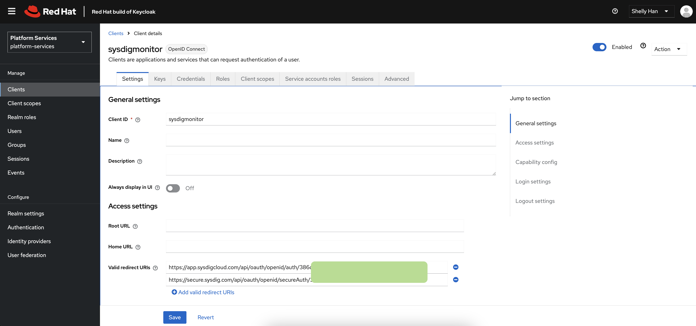
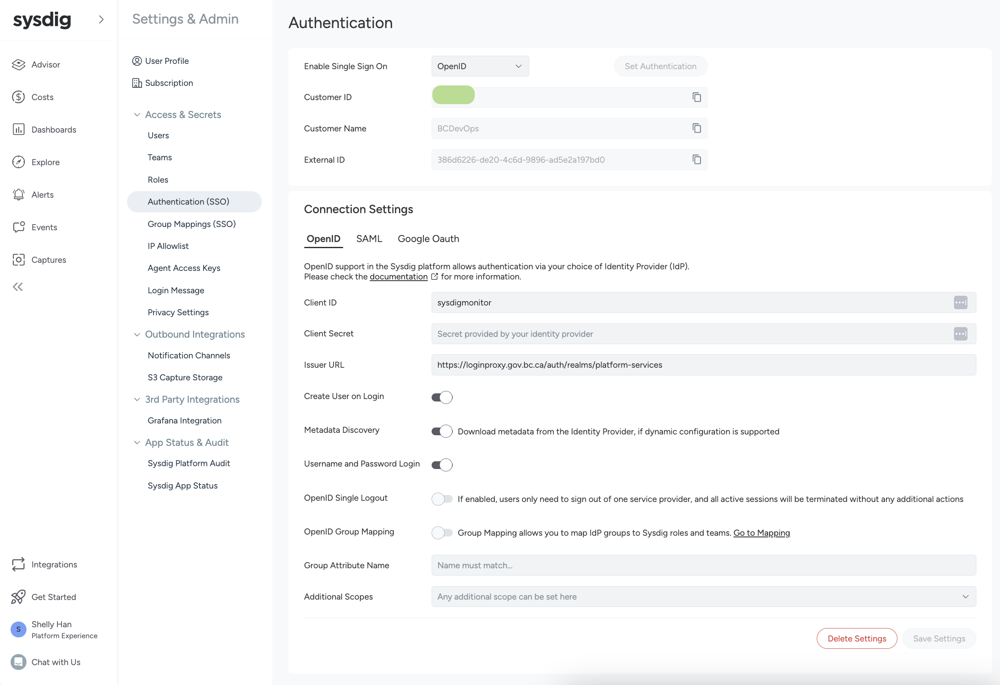

# Sysdig Maintenance

## Sysdig Installation
Currently Sysdig components are deployed with Cluster Config Management (CCM). To manually deploy Sysdig to a cluster, follow the steps in the [CCM repo](https://github.com/bcgov-c/platform-gitops-gen/blob/master/roles/sysdig_agent/readme.md).

After that's done, you'll need to setup the authentication. Sysdig is configured with OpenID Connect to leverage the BCGov Keycloak SSO instance for authentication.

### OpenID Connect Configuration
Keycloak and Sysdig were configured manually for the OIDC integration. For the keycloak setup, refer to this [doc](https://github.com/bcgov-c/platform-services-sso-integration). Note that the OIDC configuration is needed for both Sysdig Monitor and Secure, and they share the same KeyCloak client (that's why there are two valid redirects). The following screenshots were used to configure each component:




- Keycloak Realm: the `platform-services` realm is used for the integration
- Client ID: could be found from keycloak's client ID
- Client Secret: is from the credential tab from keycloak
- The Client Org: is set to be `BCDevOps`, which is used when logging in with OpenID

## Testing Sysdig Changes
If you need to test out an upgrade, or simply a configuration change:
- disable auto-sync from ArgoCD for a lab clusters (klab/clab/klab2)
- follow the [CCM repo](https://github.com/bcgov-c/platform-gitops-gen/blob/master/roles/sysdig_agent/readme.md) to make the changes in the values.yaml.j2 and populate the change to the generated manifests
- apply the change in the lab cluster instance for testing

## Sysdig Subscription
There is a limit on how many nodes we can install Sysdig onto across all OpenShift clusters.

Sysdig Monitor and Secure create two daemonsets in each cluster, which requires one license per node. To find out how many licenses are available, check from Sysdig Cloud [subscription details](https://app.sysdigcloud.com/#/settings/subscription).

The license also entitle to a certain amount of timeseries (metrics), that's why we have disabled collection for metrics not used by teams.


## Getting Support
If you encounter an issue from Sysdig that you cannot resolve, reach out to the Sysdig support via a ticket at https://cx.sysdig.com/s/cases

It's also helpful to connect with our Customer Solutions Engineer, Dustin Krysak, on RocketChat or dustin.krysak@sysdig.com.

Here are some helpful commands when you need to gather information for Sysdig support to take a look:

### Prepare for file sharing with Sysdig Support

Once you open a ticket, Sysdig Support will share with you a S3 link where you can upload the things gathered and share with them

```bash
# prep for zipping
rm -rf zip
rm zip.zip
mkdir zip

# gather the info, more details in the next section

# zip it:
zip -r zip.zip zip

# set upload URL: 
SYSDIG_UPLOAD_URL="https://sysdig-support-files.s3.<given-by-sysdig-support>"

# upload:
curl -s -S -X PUT --url "$SYSDIG_UPLOAD_URL" -H "Content-Disposition: attachment; filename=zip.zip" -T zip.zip

# update in the support case to let them know you've loaded files needed!
```


### Gather Sysdig logs and manifest files:
```shell
# login to the corresponding cluster/namespace
oc project openshift-bcgov-sysdig-agent

# get sysdig agent manifests:
oc get daemonset sysdig-agent -o yaml > zip/sysdig-agent.daemonset.yaml
oc get configmap sysdig-agent -o yaml > zip/sysdig-agent.configmap.yaml
oc get daemonset sysdig-agent-node-analyzer -o yaml > zip/sysdig-agent-node-analyzer.daemonset.yaml
oc get deployment sysdig-agent-clustershield -o yaml > zip/sysdig-agent-clustershield.deployment.yaml

# if you need the log file from all pods and all the sysdig agent setup:
./get-pod-logs.sh
./agent-gather.sh -d ./zip

# check for pods with top memory or CPU usage:
oc adm top pod --containers --sort-by=memory

# check all containers:
kubectl get pods  -o jsonpath='{range .items[*]}{"\n"}{.metadata.name}{":\t"}{range .spec.containers[*]}{.name}{", "}{end}{end}' && echo 

# look for pod with IP:
oc get pods -A -o wide | grep 10.97.94.156

# check reason for container failure:
oc -n openshift-bcgov-sysdig-agent get pods -l <label_for_filtering> -o yaml | yq '.items[].status.containerStatuses[].lastState.terminated'
```

### Get Sysdig delegated node:
```shell
# get delegated nodes:
for x in `kubectl -n openshift-bcgov-sysdig-agent get pods -l app=sysdig-agent | grep -i agent | awk '{print $1}'`; do kubectl -n openshift-bcgov-sysdig-agent logs $x | grep -i "delegated node" | tail -n 5; done

# if you don't find the logs, check the lease object
oc -n openshift-bcgov-sysdig-agent get leases
```

### Prep before making changes to the workload for troubleshooting:

Sometimes you might need to modify the sysdig setup for troubleshooting. Here are the steps to proceed:
- post in #devops-ccm RC channel to let the team know which cluster you need to work on
- disable ArgoCD auto-sync for that cluster and the Sysdig app
- most times, you'll need to modify the configmap that sysdig daemonset uses, it is `configmaps/sysdig-agent`. In the configmap, there is a key called `dragent.yaml`, that's where most of the configs are.
- once you make the changes in the configmap or the workload, manually restart the pod to make sure it'll take in the change
- after you are done troubleshooting, reenable auto-sync from ArgoCD
- post again in #devops-ccm to let the team know you are done

### Get Sysdig verbose logs:

Head to the `configmaps/sysdig-agent`, find the following section and change the console and file priority to `debug`. More details about [logging level](https://docs.sysdig.com/en/sysdig-secure/change-agent-log-level-globally/).

```yaml
log:
  console_priority: warning
  file_priority: info
```

### Check Sysdig Agent status:

Look for a dashboard in Sysdig Monitor called `Sysdig Agent Health & Status`. Now that you've enabled verbose logging, here somethings you can check for if Sysdig is getting too busy with system calls:

```shell
# rsh into a Sysdig Agent pod, then
cat /opt/draios/logs/draios.log | grep -i ne=

# then you'll see the status like this:
2025-04-16 18:00:29.120, 3917710.3920250, Information, analyzer:5294: ts=1744826429, ne=5082, de=0, c=59.98, fp=0.28, sr=128, st=0, fl=41, lat=41.47

```
Here's what you can check for:
- expect `de` (dropped events) to be 0
- expect `sr` (sampling ratio) to be lower than 8 (max is 128, whenever there are more, it'll double)
- `c` is the CPU usage, over 60 is getting busy

### Gather Sysdig Agent CPU and Memory profile:

```sh
# change in configmaps/sysdig-agent:

dragent_cpu_profile_enabled: true
cointerface_cpu_profile_enabled: true
cointerface_mem_profile_enabled: true
watchdog:
  heap_profiling_interval_s: 60
  warn_memory_usage_mb: 1

log:
  file_priority: debug

# add the env var to daemonset/sysdig-agent:
env:
  - name: MALLOC_CONF
    value: "prof:true"

# pick the Sysdig agent pod that's busy and restart it.

# capture the result after waiting for 20 mins:
oc cp sysdig-agent-xxxxx:/opt/draios/logs/. ./zip/logs
```

### check Sysdig Teams CR

Sometimes you might need to check the custom resources used by the sysdig operator, here are some commands:

You can also find an example [here](./sysdigteam-sample.yml)

```shell
ocsa get sysdig-teams --all-namespaces
ocsa get sysdig-teams --all-namespaces | wc -l
ocsa get sysdig-teams --all-namespaces -o json | jq -r '.items[] | select(.status.conditions[]?.status=="False") | "\(.metadata.namespace) \(.metadata.name)"'

# check a specific one
ocsa -n xxxxxx-tools describe sysdig-team xxxxxx-team
ocsa -n xxxxxx-tools get sysdig-team xxxxxx-team -o yaml
```
